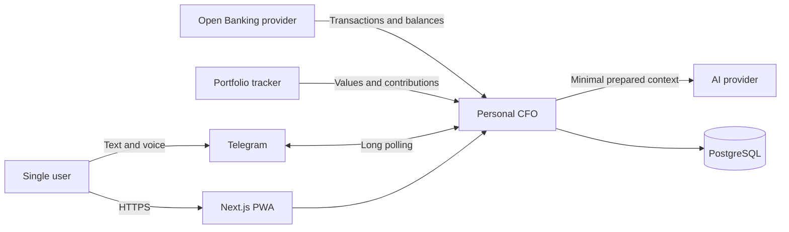
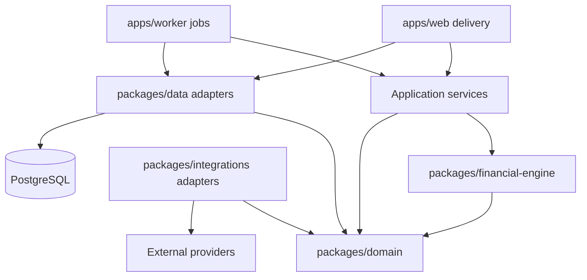
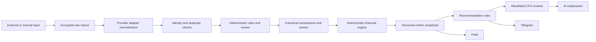
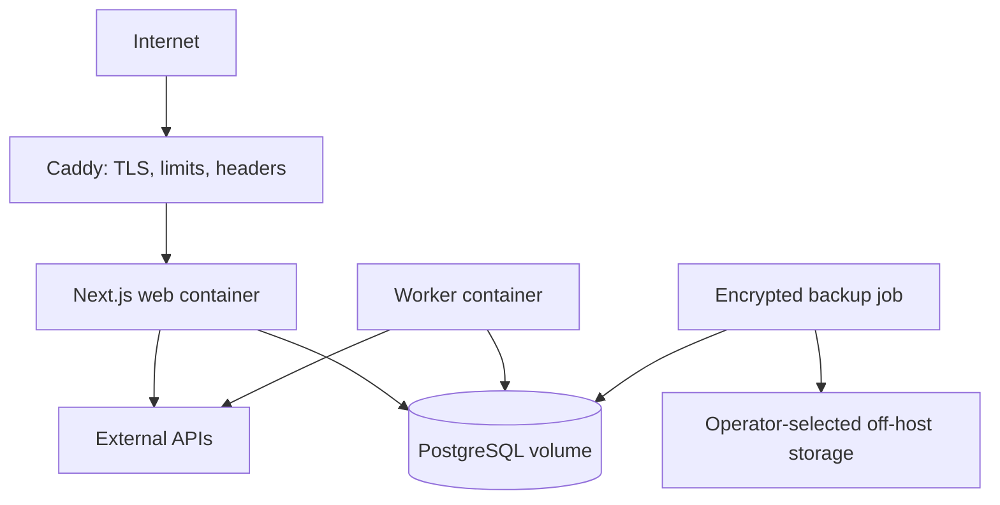

# Personal CFO Architecture

Related specifications: [requirements](FRD.md), [canonical data model](DATA_MODEL.md), [financial engine](FINANCIAL_ENGINE.md), [decision log](DECISIONS.md), and [implementation plan](IMPLEMENTATION_PLAN.md).

## Purpose and Constraints

Personal CFO is a single-user, self-hosted financial decision system. V1 is a modular monolith: one codebase, one PostgreSQL database, one web process, and one worker process. The design optimizes for correctness, traceability, and simple operations rather than scale.

The non-negotiable boundary is that authoritative financial values are produced by deterministic code. AI may classify ambiguous text and explain prepared results, but it cannot calculate or mutate financial state. Provider payloads are retained at the integration boundary and normalized before reaching the domain.

## System Context



Open Banking, portfolio, Telegram voice, and AI adapters are later milestones. Stage 6 includes the text-only Telegram Bot API adapter; no external provider is required by the financial core.

## Repository and Module Boundaries

The implementation will use a pnpm workspace without an additional monorepo orchestrator:

```text
apps/
  web/                  Next.js App Router, PWA, route handlers
  worker/               scheduled and asynchronous job consumers
packages/
  domain/               canonical types, invariants, ports
  financial-engine/     pure calculations and deterministic rules
  data/                 Drizzle schema, repositories, migrations
  integrations/         bank, portfolio, Telegram, FX, and AI adapters
docs/                   requirements and design documents
```

`packages/domain` and `packages/financial-engine` contain no Next.js, PostgreSQL, Telegram, Open Banking, or AI imports. `packages/data` implements repository ports declared by the application/domain boundary. Provider-specific DTOs remain inside `packages/integrations`.

Application services are app-local modules under `apps/web/src/application` and `apps/worker/src/application`: web services handle interactive commands and queries, while worker services handle ingestion and recalculation. Shared financial behavior belongs in the engine, and shared provider-neutral types/ports belong in the domain package; app orchestration is extracted only after real duplication appears.



Arrows mean “depends on.” Delivery code coordinates use cases but contains no financial formulas. Application services establish transactions, authorization, idempotency, and job dispatch. Repositories never decide financial meaning.

## Canonical Data Flow



Every stage records its source identifier, processing status, and correlation ID. Normalization is idempotent. Plausible transfers that cannot yet be matched enter an explicit review state; they do not flow into authoritative consumption or income. A classification correction, transfer resolution, cash reconciliation, or Sinking Fund allocation change queues recalculation from the earliest affected effective date. Old snapshots remain reproducible and are superseded rather than overwritten.

## Runtime Responsibilities

### Web and API

The Next.js application serves the installable PWA and `/api/v1` route handlers. It owns local authentication, request validation, CSRF protection, query responses, and explicit user commands such as recording cash activity, reconciling a physical cash count, correcting classification, managing Sinking Funds and their allocation policy, resolving transfer candidates, or accepting a recommendation. Command endpoints require an `Idempotency-Key`; query endpoints are side-effect free.

Public endpoints are limited to liveness/readiness checks and provider OAuth callbacks. OAuth callbacks validate state and PKCE before storing encrypted tokens. Financial endpoints require a server-side session and never expose raw provider payloads.

The API serializes money and exact ratios as strings. It returns metric completeness and provenance with values so a client cannot present partial data as authoritative.

### Worker and Background Jobs

The worker uses pg-boss in the application PostgreSQL database. Jobs include:

- connection synchronization and pending-to-booked reconciliation;
- normalization, classification, and transfer matching;
- primary-pay-cycle detection and closure;
- opt-in deterministic Sinking Fund allocation;
- affected-period recalculation and daily snapshots;
- recurring-transaction and spending-drift detection;
- recommendation evaluation and restrained notification delivery;
- Telegram long polling and message processing.

Jobs carry entity IDs, input versions, cause/cutoff, and correlation metadata—not secrets or full financial payloads. Financial recalculation and Sinking allocation use PostgreSQL-backed pg-boss queues. Transient failures receive three attempts with five-second exponential backoff; permanent canonical-input failures are recorded and routed directly to bounded dead-letter metadata. Scheduled jobs use Europe/Riga calendar boundaries; stored execution times are UTC. A unique owner/version or owner/salary key prevents duplicate schedules.

A recalculation reads one repeatable-read database snapshot for its requested input version. Before publishing, it rechecks the owner version under the same advisory lock used by financial mutations. Obsolete jobs are marked `superseded`, are not retried, and cannot deactivate authoritative snapshots from a newer input version.

### PWA

The PWA is a decision-oriented projection over API data. It displays Net Worth, CCR, liquidity, Safe to Invest, investments, Sinking Funds, forecasts, and actionable insights. It performs display formatting and temporary what-if input only. It does not reproduce financial formulas or cache sensitive data for offline mutation. Service-worker caching is limited to static application assets; authenticated financial responses are network-only.

### Telegram

The worker owns a dependency-free native-fetch Telegram Bot API adapter. It verifies the configured non-bot sender and private chat before parsing, and silently terminalizes forwarded, edited, media, group, channel, bot-authored, unauthorized, and unrelated updates. Deterministic parsing produces a validated proposal, bounded clarification, or unsupported result. An `AmbiguousTransactionClassifier` port exists with a disabled production implementation; no AI SDK or call participates in Stage 6.

Long-poll pages and their next offsets commit atomically before the worker requests a higher offset. Startup drains the durable local inbox first. Five-minute leases recover crashed processors; unexpected runtime failures use a separate persisted three-attempt state with bounded backoff. Financial effects, update finalization, entity/message links, pending replies, audit/version state, and recalculation enqueue share the command transaction. Replies occur only after commit and use an independent delivery retry state; an indeterminate network outcome is not retried. Shutdown aborts polling and drains the active database operation before pg-boss and PostgreSQL stop. Voice remains a separate later stage.

### Financial and Recommendation Engines

The financial engine accepts immutable canonical inputs and settings and returns typed results without I/O. It owns all formulas, pay-cycle policy, current-cycle Sinking requirements, rounding, missing-data behavior, and explanation components. A separate deterministic recommendation engine consumes those outputs and emits candidates with rule IDs, evidence, severity, and expiry. Neither engine sends messages, creates allocations, or writes to the database. Application services may turn an opt-in allocation result into an audited command.

### AI Explanation Layer

An AI adapter receives an allowlisted `CfoContext`: calculated amounts, metric changes, deterministic recommendation evidence, and only the minimum labels required for explanation. Raw bank payloads, credentials, account numbers, and unrelated transaction descriptions are excluded by default. AI output is stored as non-authoritative `CfoInsight` text linked to the calculation and prompt-policy versions. Invalid, unsupported, or number-inventing output is rejected or replaced by a deterministic template.

### Integration Adapters

Bank, portfolio, FX, Telegram, and AI integrations implement domain ports. Each adapter maps provider objects into canonical commands and exposes provider-neutral errors. Provider schema changes therefore cannot propagate into the financial engine. Connection capabilities record whether balances, pending transactions, stable IDs, holdings, or contribution history are available.

The Stage 7 portfolio boundary is specified in [PORTFOLIO_CONTRACT.md](PORTFOLIO_CONTRACT.md). Self-hosted Portfolio Manager v1 is the selected production provider, pinned to upstream commit `af86470e3b3a803f7a75f496c24c580f67a5a8a0`; [PORTFOLIO_PROVIDER_PORTFOLIO_MANAGER.md](PORTFOLIO_PROVIDER_PORTFOLIO_MANAGER.md) defines the mapping. Sharesight V2/V2.1 remains an independent reference/validation adapter. Both use explicit manual CLIs and encrypted pre-decoding receipts. A shared owner/account binding prevents simultaneous provider authority. Portfolio Manager commits its opaque cursor with normalized revision state, while Sharesight retains its application-owned full-history windows. The financial engine imports neither adapter nor persistence code, and neither sync activates evidence in canonical financial tables.

Stage 7.1.1 validated the read boundary against the provisioned sandbox. The sandbox exposes V2/V2.1 and V3, but the stable binding remains V2/V2.1. Identity-less unconfirmed records terminate at encrypted receipt quarantine; they cannot cross into revision identity or canonical principal. Live gaps for contributions, cash components, VGLA, and natural corrections are documented provider-data limitations rather than inferred successes.

Stage 7.2B adds a dependency-free bearer-authenticated Portfolio Manager client for exactly three read routes. Strict decoders preserve exact decimal lexemes and verify revision fingerprints. Complete EUR totals remain authoritative with included cash; partial valuations retain only their known subtotal and cannot project into Net Worth. Capital flows remain provider evidence, and the sync result structurally fixes confirmed principal creation to zero. No scheduler or provider write exists.

## Error Handling and Data Completeness

Errors are classified as validation, authentication, transient provider, rate limit, provider contract, conflict/duplicate, or internal invariant failures. Transient failures retry with jitter. Authentication failures disable the connection and request user action. Contract failures quarantine the raw record for review. Invariant failures stop the affected calculation and emit a high-severity operational alert; they never coerce missing values to zero.

Every derived result is `complete`, `partial`, or `unavailable`, with stale sources, unresolved transfer candidates, material cash variances, and missing periods listed. Partial results may be displayed with a warning but cannot produce invest-more recommendations when the ambiguity is material. A failed sync does not erase the last valid snapshot.

## Authentication and Security Boundaries

V1 has one bootstrapped local account. Passwords use Argon2id (64 MiB, three iterations, parallelism one, 32-byte output). Session and CSRF values contain 32 random bytes and only SHA-256 hashes are stored. Login revokes prior sessions; sessions expire after seven days and `lastUsedAt` writes are throttled. The session cookie is `HttpOnly`, `SameSite=Lax`, `Path=/`, and secure by default. Commands require a session-bound CSRF token, exact Origin, validated input, and `Idempotency-Key`. Application login throttling is implemented; stock-Caddy edge throttling remains production deployment work.

The only insecure-cookie exception is `SESSION_COOKIE_SECURE=false` with `NODE_ENV=development` and a loopback HTTP `APP_ORIGIN`; every other insecure configuration fails startup. There is no public signup.

The first user is created through an explicit one-off administration command with hidden, repeated TTY password entry. There is no default credential, public registration, password value in Compose, or password-reset email flow in V1.

Integration tokens are encrypted with authenticated encryption using a versioned key supplied outside the database. Banking passwords are never requested or stored. Logs redact tokens, account identifiers, raw descriptions, message text, and monetary payloads. Database and backup access is limited to the application operator. Data sent to an AI provider is minimized and separately auditable.

## Deployment and Operations



Docker Compose runs Caddy, web, worker, and PostgreSQL on one Linux host. Only Caddy publishes ports. Containers run as non-root users, use read-only filesystems where practical, and receive secrets through deployment-managed files or environment injection. Database migrations run as an explicit release step, never automatically from multiple application replicas.

Health endpoints distinguish process liveness from readiness to reach PostgreSQL and the job queue. Structured JSON logs include request/job correlation IDs, outcome, duration, and provider category without financial content. Operational metrics cover sync age, quarantined records, dead letters, calculation duration, stale snapshots, login failures, and backup age.

Create encrypted daily PostgreSQL backups, retain them off-host, and verify integrity after creation. A documented restore drill must be run before production use and periodically thereafter. Exact RPO, RTO, retention, and destination remain open decisions in `DECISIONS.md`.

## Evolution Rules

The single-user owner ID is still present on user-owned records so multi-user support does not require redefining ownership. It is not permission to add multi-user UX in V1. New providers enter through adapters; new calculations enter through versioned pure functions. Split a runtime into a service only after measured operational or deployment needs demonstrate that the modular monolith is insufficient.

## Technology References

- [Node.js release schedule](https://nodejs.org/en/about/previous-releases)
- [Next.js self-hosting guidance](https://nextjs.org/docs/app/guides/self-hosting)
- [Drizzle PostgreSQL types](https://orm.drizzle.team/docs/column-types) and [migration workflow](https://orm.drizzle.team/docs/migrations)
- [pg-boss PostgreSQL job queue](https://github.com/timgit/pg-boss)
